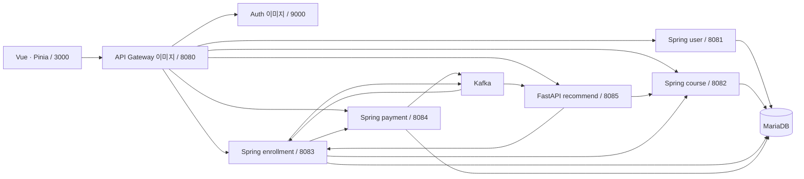

# 개인 개발 리팩토링 기반 설계

작성일: 2026-10-06. 확인 기준: 원본 `main`의 `980da07` 소스. 상태: **초기 설계**. 이 문서의 신규 API, 데이터 정책, 단계별 기능은 아직 구현하지 않았다. 이번 전환은 개발 지침과 설계 기반을 정리하며 실제 LLM 호출·주문 변경·인프라 교체는 별도 작업이다.

## 1. 목표와 범위

첫 제품 흐름은 **자연어 구매 요청 → 조건 확인·수정 → 규칙으로 업체 비교 → 근거 설명**이다. 최종 선택과 발주는 구매자가 수행한다. 기존 팀 개발 기록은 보존하고, 개인 개발의 결정과 검증은 [ADR](decisions/0001-personal-development.md)와 [백로그](../development/backlog.md)에 기록한다.

이번 기반 설계에서는 기존 실행 구조와 API를 유지한다. Java 코드 수정은 필요에 따라 가능하지만, `/api/courses` 등 경로·3000 포트·역할·반복 발주 제약을 이름 변경으로 해결하지 않는다.

| 선택지 | 얻는 것 | 비용·포기하는 것 | 초기 판단 |
| --- | --- | --- | --- |
| 기존 Vue·Spring·FastAPI 구조에서 추천 기능만 확장 | 현재 흐름과 이력을 활용하고 작은 변경으로 검증 | 여러 서비스의 기동·연동 부담 유지 | 채택 |
| 단일 백엔드로 통합 | 개인 운영·배포 단순화 | 인증·결제·이벤트·DB 계약을 함께 다시 검증해야 함 | 실제 운영 부담을 측정한 뒤 재검토 |

벡터 DB, 새 MSA, 언어 전환, 전면 디렉터리·enum·API rename은 첫 단계에서 제외한다. 카탈로그 조건 비교에는 현재 데이터와 규칙 계산으로 충분하다. 문서 검색이 제품 요구로 확인되면 RAG를 별도 설계한다.

## 2. 현재 구조와 실제 경계

근거: [compose](../../docker-compose.yml), [API 명세](../spec/api-spec.md), 아래 소스. 컨테이너 실행 검증을 이번 문서 작업에서 수행한 것은 아니다.



Eureka는 서비스 등록·검색을 담당한다. MariaDB는 서비스별 독립 DB가 아닌 같은 `lecture_db`이며, 기존 테이블과 연결을 당장 분리하지 않는다.

| 경계 | 현재 책임 | 첫 확장의 책임 |
| --- | --- | --- |
| Vue | 조건 입력, `description` 파싱, 필터·조건 점수, 이력 추천 표시 | 자연어 초안 확인, 서버 매칭 결과와 근거 표시 |
| course-service | 품목·가격·등록자, 계약 종료일, 공급기업 QCD 집계 | 기준 데이터 제공; 필요한 구조 필드는 별도 마이그레이션 |
| enrollment-service | 발주 생성, 즉시 결제 요청, 배송·납품 상태, 납품 평가 | 첫 단계 유지; 추천으로 주문이 생성되지 않게 함 |
| payment-service | UUID로 성공 처리하는 실습 결제, 완료 이벤트 | 실결제 아님을 명시하고 첫 단계 유지 |
| recommend-service | 이력·카테고리 기반 후보 + QCD 점수 | 확인된 조건 검증·매칭, LLM 초안 추출·설명 |

추천 서비스의 규칙 함수는 HTTP·LLM 호출 없이 입력 데이터만 받아 결과를 반환한다. 기존 `scoring.py`를 활용하고, 필요한 순수 매칭 함수만 추가한다. 한 제공자를 위해 추상 인터페이스·팩토리·플러그인 구조를 만들지 않는다.

현재 발주 상태는 `PENDING → SHIPPING → DELIVERED`다. 결제 완료가 SHIPPING, 구매기업의 품질 등록·성과 평가가 DELIVERED 전환 신호다. `ACTIVE`는 기존 발주의 레거시 값이며 `CANCELLED`는 도달 API가 없다([Enrollment.java](../../enrollment-service/src/main/java/com/lecture/enrollment/entity/Enrollment.java)). 배송완료 통보·취소·견적 승인을 이미 구현한 것으로 가정하지 않는다.

## 3. 먼저 기록할 문서·코드 차이

다음은 관찰한 현재 상태다. 어느 기준이 최종 의도인지는 확정하지 않았으며, 이번 작업에서 점수나 문서를 한쪽에 맞춰 바꾸지 않는다.

**조건 점수의 축·배점이 다르다.** [전환 전 팀 제품 개요](../history/team-project/overview.legacy.md#점수-배점)는 다음을 적고 있다.

> | 품목 적합 | 30 | 품명·세부품명·규격 키워드 충족 여부 |
> | 가격 | 25 | 수량과 총예산 대비 등록 단가 |
> | 납기 | 20 | 최대 납품일수 충족 여부 |
> | 공급지역 | 10 | 요청 지역 공급 가능 여부 |
> | 인증 | 10 | KS 등 요청 인증 보유 여부 |
> | 조달 등록 | 5 | 우수제품·MAS 등록 여부 |

[API 명세](../spec/api-spec.md#점수-2--조건-적합도-100점--프론트엔드)는 다음을 적고 있다.

> | 예산 여유 | 40 | `40 × (1 − 단가 × 수량 ÷ 예산)` |
> | 일정 여유 | 20 | `20 × (요청 납기 − 납품일수) ÷ 요청 납기 ÷ 0.5`, 절반 이상 여유면 만점 |
> | 인증 부합 | 20 | 요청 인증 전부 보유 20 / 일부 12 / 없음 0 |
> | 지역 근접 | 20 | 거리 12 (같은 시·도 12 / 인접 8 / 그 외 4) + 운임조건 8 (무조건 전지역 8 / 운임 별도 3) |

같은 명세의 최종 산식 원문은 `종합 = 점수1 × 0.5 + 점수2 × 0.5`다.

실제 [procurement.js](../../vue-frontend/src/utils/procurement.js)의 `evaluateCourse` 원문은 다음과 같다.

```js
itemFit: (productMatch ? 12 : 0) + (detailMatch ? 6 : 0) + (specificationMatch ? 6 : 0) + (keywordMatch ? 6 : 0),
price: Math.round(clamp(25 * (1.15 - budgetRatio), 0, 25)),
delivery: specs.deliveryDaysValue === null ? 0 : Math.round(clamp(20 * (30 / specs.deliveryDaysValue), 0, 20)),
region: regionMatch ? 10 : 0,
certification: specs.certification && specs.certification !== '해당 없음' ? 10 : 0,
procurement: (specs.excellent === 'Y' ? 3 : 0) + (specs.mas === 'Y' ? 2 : 0)
```

실제 [CourseListView.vue](../../vue-frontend/src/views/CourseListView.vue)의 조건 결과 원문은 다음과 같으며, QCD 50:50 합산을 하지 않는다.

```js
const scored = courses.map(course => evaluateCourse(course, criteria))
if (!hasMatched.value) return scored
return scored.filter(course => course.eligible).sort((a, b) => b.score - a.score)
```

**평가 문턱과 신뢰 플래그도 예외가 있다.** 명세 원문은 “평가가 0건이면 각 축에 **기본점수(만점의 절반, Q 25 / D 15 / C 10)** 를 주고 `performanceTrusted: false` 를 붙인다.” 반면 [scoring.py](../../recommend-service/app/service/scoring.py)는 간편 품질 등록의 실측값을 살리기 위해 다음을 사용한다.

```python
trusted = evaluated >= MIN_EVALUATIONS or has_measured_performance
displayed_evaluated = max(evaluated, 1 if has_measured_performance else 0)
```

납기 평가가 0건이어도 불량률이 있으면 `true`가 될 수 있다. 실제 건수·관측 축과 “믿을 수 있음”을 같은 의미로 표시할지 결정해야 한다. 초기에 QCD와 조건 점수를 따로 표시하고, 가중 합산은 정책을 결정한 뒤 추가한다.

## 4. 매칭 정책 제안

현재 이력 추천은 구매 조건을 받지 않으며, 신규 사용자는 거래건수 상위 30개를 먼저 좁힌다([recommend_service.py](../../recommend-service/app/service/recommend_service.py)). 새 조건 매칭은 이 후보 제한을 재사용하지 않는다. 활성·계약 유효 카탈로그에서 **필수조건 판정 → 통과 품목 점수 → 상위 결과** 순서로 처리한다.

`eligible`, `ineligible`, `needsReview`를 구분한다. 필수값을 확인할 데이터가 없으면 `needsReview`이고 확정 충족 순위에 포함하지 않는다. 조건을 자동 완화하지 않으며, 후보가 없으면 제외 이유와 사용자 수정 항목을 반환한다.

| 조건 | 판정과 근거 |
| --- | --- |
| 품명·규격·단위 | 카탈로그의 명시적 값으로 비교; `Φ300mm×6m`을 직경만 맞는 품목과 같다고 보지 않음. 의미가 모호하면 확인 필요 |
| 수량·금액 | 양의 정수 수량, 카탈로그 단가와 서버 Decimal 계산; 클라이언트·LLM의 견적값을 채택하지 않음 |
| 예산 범위 | `itemSubtotal` 또는 `total`을 사용자가 확인. 운임·세금이 불명확하면 총비용 충족을 확정하지 않음 |
| 납기 | 기준일 `Asia/Seoul`과 최대 일수/희망 날짜를 명시. 등록 납품일수 누락은 충족으로 처리하지 않음 |
| 공급지역 | 기존 법정 지역 코드와 제외 조건을 사용; 전지역 문구만으로 제주 제외 등을 무시하지 않음 |
| 인증 | 필수 인증을 카탈로그에 명시된 목록과 비교; `description`의 자기 신고 정보임을 표시. 인증서 유효성 확인은 별도 기능 |
| 상태·계약기간 | 비활성·만료 제외. 계약 종료일 미상은 확인 필요; 단건 조회 가능과 구매 가능을 구분 |

현재 상세는 대부분 `description` 안의 구분자 텍스트다. 기존 `parseCapability`의 별칭·샘플을 재사용해 서버 파싱 결과의 동등성을 확인하되, 오류·누락을 빈 값과 구분한다. Python `CourseResponse`는 현재 `contractEnd`를 선언하지 않아 응답에서 보존하지 않으므로 신규 매칭 스키마에 명시해야 한다.

조건 점수 정책을 결정한 뒤 서버만 산식의 기준이 된다. 브라우저는 반환 점수를 표시한다. 기존 화면을 유지하다 새 매칭 화면을 전환할 때 중복 계산을 제거하며, 변경 전후 고정 카탈로그 사례로 점수 차이를 검토한다.

## 5. API 제안과 확인 흐름

기존 `GET /api/recommend/{user_id}`와 응답은 호환 유지한다. 아래 신규 경로는 고정 게이트웨이의 `/api/recommend/**` 안에 둔다. 실제 게이트웨이를 통한 POST 허용은 구현 시 확인한다.

| 단계 | 제안 계약 | 동작 |
| --- | --- | --- |
| parse | `POST /api/recommend/parse` | `{text, locale:"ko-KR"}` → 조건 초안, 미확인 항목, 필드별 원문 근거 |
| confirm | Vue의 조건 확인·수정 화면 | 초안 수정 후 확인; API·DB를 추가하지 않고 화면 상태로 처리 |
| match | `POST /api/recommend/match` | `{criteria, confirmed:true}` → 서버 검증·필터·점수·근거·설명 |

확인은 UX 단계이며 `confirmed:true` 자체가 데이터의 진실성·권한을 증명하지 않는다. 서버는 모든 입력을 다시 검증한다. 새 API는 사용자 ID·공급기업 ID를 본문에서 받지 않고 검증된 로그인 신원으로 처리한다.

| `criteria` 필드 | 제안 타입·제약 |
| --- | --- |
| `product`, `detailProduct`, `specification` | 문자열; 품명 필수, 규격·단위가 모호하면 확인 항목 |
| `quantity`, `unit` | 양의 정수, 카탈로그 단위 문자열; 필요한 값이 없으면 match는 422 |
| `budget`, `budgetScope` | 소수 2자리까지 금액 문자열 또는 null, `itemSubtotal`/`total`; 양수·통화 KRW 검증 |
| `supplyRegions` | 기존 지역 코드의 목록; 카탈로그와 코드 기준 검증 |
| `maxDeliveryDays`, `requestedDeliveryDate` | 양의 정수 또는 ISO 날짜; 둘 다 입력하면 모순 검증, 상대 날짜의 기준일 표시 |
| `requiredCertifications`, `excellentOnly`, `masOnly` | 인증 문자열 목록, boolean; 미언급 조건을 AI가 추가하지 않음 |

parse는 최대 2,000자 입력, 알려진 필드만 허용한다. 응답은 `draft`, `missingFields`, `ambiguities`, `fieldEvidence`, `mode`를 갖는다. `fieldEvidence`는 원문의 해당 구절이며, 모델이 말한 확신도를 업무상 신뢰 점수로 사용하지 않는다.

match 응답은 `criteria`, `evaluatedAt`, `scorePolicyVersion`, `matches`, `needsReview`, `exclusionSummary`, `explanationMode`를 갖는다. 후보에는 `courseId`, `supplierId`(현재 `instructorId`), `conditionScore`, `qcdScore`, `scoreBreakdown`, `itemSubtotal`, `costCompleteness`, `checks`, `evidence`, `explanation`을 둔다. 정책 미결 상태에서 종합 점수를 확정하지 않는다.

근거는 `courseId`, 필드명, 실제 값, 출처 경로(`price`, `description` 등), 조회 시각으로 구성한다. 같은 업체의 여러 품목은 `supplierId`로 묶어 보이되 품목별 조건·단가를 유지한다. QCD는 공급기업 단위라는 현재 의미를 보존한다.

## 6. LLM 책임과 실패 정책

제공자·모델은 미정이다. 실제 호출을 넣을 때 기존 `httpx`와 Pydantic 검증으로 시작한다. LLM은 자연어의 초안을 추출하고, 검증된 후보 근거를 문장으로 설명한다. 금액 계산·필수조건 충족·인증 진위·최종 순위·발주 실행 권한은 갖지 않는다.

설명 입력은 확인된 조건과 서버 근거만 전달한다. 사용자 요청·카탈로그 설명 안의 명령은 데이터로 취급한다. 도구 실행과 주문·결제 권한은 제공하지 않는다. 근거에 없는 숫자·인증·품목을 반환하면 설명을 폐기하고 기존 규칙 문구로 대체한다.

| 실패 | 제안 응답·사용자 복구 |
| --- | --- |
| 추출 누락·모호한 규격 | 200 초안 + 미확인 항목; 사용자가 입력하고 확인 |
| 제공자 미설정·시간 초과·잘못된 구조 | `mode:"manual"`과 빈/검증 가능한 초안; 수동 조건 입력 유지 |
| 조건 형식·날짜 모순·음수 금액 | 422 필드 오류; 잘못된 조건으로 매칭하지 않음 |
| 후보 0개 | 200 빈 결과 + 제외 이유; 자동 조건 완화 없음 |
| 카탈로그 서비스 실패 | 503 + 재시도 안내; 빈 후보와 구분 |
| 설명 실패·근거 불일치 | 규칙 설명으로 fallback; 순위·조건 판정 그대로 유지 |
| 만료 토큰·신원 대조 실패 | 401/403; 수동 입력을 인증 우회로 사용하지 않음 |

현재 `course_client.py`는 HTTP 오류를 빈 목록으로 돌려준다. 신규 match에서는 서비스 실패를 별도 오류로 구분하고, 기존 이력 추천의 fallback과 섞지 않는다. 최초 호출 제한은 서버 시간 제한 10초·자동 재시도 없음으로 제안하며, 비용·지연을 측정해 조정한다. 원문 전체·담당자 연락처·토큰은 기본 로그에 남기지 않는다.

## 7. 인증·게이트웨이 교체 조건

`auth-server`·`api-gateway`는 저장소에 앱 소스가 없고 이미지에 의존한다. 팀 기록의 제약은 [constraints.md](../constraints.md)에 있다. 개인 개발에서는 교체가 가능하지만 계약과 검증을 함께 마련한다.

현재 `course-service/.../SecurityConfig.java`는 `anyRequest().permitAll()`이며 컨트롤러는 `X-User-Id`를 사용한다. `recommend_router.py`는 토큰을 검증해도 경로 `user_id`와 신원을 대조하지 않는다. 브라우저 `api/auth.js`는 `VITE_CLIENT_SECRET`을 사용하는 토큰 교환 흐름이다. 이를 공개 배포에 그대로 신뢰하지 않는다.

1. 먼저 JWT의 실제 사용자 ID·역할 클레임을 확인해 신원 매핑을 기록한다. 없는 클레임을 가정하거나 요청 본문의 ID를 대체값으로 쓰지 않는다.
2. 신규 API에 구매기업 역할·본인 데이터 접근 검증을 넣고, 공급기업의 품목 변경은 등록자 소유권을 검증한다. 내부 집계·결제 경로는 일반 사용자에게 허용하지 않는다.
3. 기존 경로를 유지하는 소스 보유 게이트웨이와 인증 대안을 별도 ADR로 선택한다. 환경별 redirect URI, 공개 클라이언트의 PKCE 또는 서버 토큰 중계, 헤더 위조 방지, 서비스 직접 접근 정책을 검증한다.
4. 로그인·갱신·로그아웃·401/403·역할·타인 품목/발주 접근·기존 거래 회귀가 통과하면 교육 이미지 의존을 제거한다. 새 역할·포트·경로 이름 변경은 그 후 별도 결정이다.

## 8. 주문 확장과 단계별 완료 기준

반복 발주는 UNIQUE 삭제만으로 해결하지 않는다. 현재 `activateEnrollment(userId, courseId)`와 결제 완료 이벤트가 사용자·품목 쌍으로 주문을 찾는다. 같은 쌍의 주문이 여러 개면 확정 대상을 식별할 수 없다.

주문번호와 결제·이벤트의 `orderId/enrollmentId`, 재시도 식별키, 상태 전이를 먼저 설계한다. 데이터 백업·백필·구제약 해제 순서와 복구 SQL을 함께 만들고 기존 볼륨을 지우지 않는 마이그레이션으로 검증한다. 견적 요청·제출·승인 후 발주 흐름은 이 단계 이후 추가한다. 실제 PG 연동도 별도 결정이다.

| 단계 | 완료 기준 | 검증 |
| --- | --- | --- |
| 0. 설계 기반 | 팀 이력 보존, 개인 규칙, 미결 정책·작은 백로그 | 문서 링크·담당 범위·소스 근거 대조 |
| 1. 규칙 매칭 | 점수·누락 정책 결정, 필수조건 필터, 서버 match 계약 | 고정 사례의 통과/탈락/확인필요·Decimal·권한·503 점검 |
| 2. 자연어 입력 | 확인 화면과 추출 fallback; 자동 발주 없음 | 한국어 요청의 필드 기대값·모호성·시간 초과·미설정 점검 |
| 3. 근거 설명 | 설명과 점수의 출처 연결, 규칙 fallback | 근거 없는 금액·인증을 포함한 설명 폐기 확인 |
| 4. 독립 실행 | 교육 이미지 대체, 인증·배포 경로 재현 | 깨끗한 환경 기동과 로그인/거래 회귀, 헤더 위조·권한 점검 |
| 5. 주문 확장 | 식별자·상태·결제 마이그레이션 후 반복 발주·견적 협의 | 기존 데이터 보존, 중복 이벤트·재시도·동시 주문 점검 |

첫 구현은 LLM 없이 조건 스키마와 순수 필터 함수를 추가하는 것이다. 등록 데이터로 판단 불가능한 조건부터 명시하면 이후 LLM을 붙여도 기능의 판정 기준을 유지할 수 있다.
