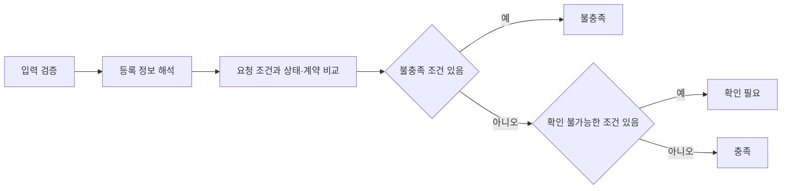

# 실행 환경 확인과 구매 조건 필터 개발 설계

작성일: 2026-10-06. 기준 코드: 개인 저장소 `main`의 `b7e2b44`.
이번 범위는 기존 로그인·조회·발주·결제의 실행 기준을 확보하고, 구매 조건을 충족·불충족·확인 필요로 판정하는 것이다. 먼저 실행 흐름을 확인하되, 조건 필터 자체는 Docker 없이 검증할 수 있게 만든다. 기존 Vue·Spring·FastAPI와 API 경로를 사용한다.

이 문서의 필터와 검증 절차는 구현 설계다. 작성 당시 확인한 것은 Docker 메타데이터·Compose 설정·코드·시드 데이터이며, 로그인·발주·결제는 당시 실행하지 않았다. 이후 작업 1의 실제 실행 결과는 [로컬 실행 검증 결과](../development/runtime-check-result.md)에 기록했다. 아래 사전 관측과 실행 명령은 설계 시점의 기준을 유지한다. 상위 설계는 [리팩토링 기반](refactoring-foundation.md), 구현 순서는 [백로그](../development/backlog.md)를 따른다.

## 현재 확인한 실행 조건

| 항목 | 현재 관측 | 실행 단계에서의 처리 |
| --- | --- | --- |
| Docker | 클라이언트·서버 29.6.2, 서버 `aarch64` | Docker는 실행 가능; 서비스 준비 여부는 따로 확인 |
| 인증 이미지 | `msa-lecture/auth-server:1.0`, `linux/arm64` | 이미지 재확보 없이 이 컴퓨터에서 확인 가능 |
| 게이트웨이 이미지 | `msa-lecture/api-gateway:1.0`, `linux/arm64` | 다른 CPU 환경의 실행 가능성은 별도 확인 |
| 기존 컨테이너 | `lecture*` 10개가 중지되어 있음 | 예전 이미지와 현재 코드가 같은 상태라고 가정하지 않음 |
| Compose 프로젝트 | 기존 컨테이너 소속은 `msa-lecture` | 현재 폴더 이름으로 새 프로젝트를 만들면 이름 충돌·다른 DB 볼륨 사용 가능 |
| 데이터 볼륨 | `msa-lecture_mariadb_data`, `msa-lecture_kafka_data` | 동일 프로젝트 이름을 지정해 기존 볼륨을 유지 |
| Compose 설정 | `docker compose config --quiet` 통과 | 기존 컨테이너에 적용된 추가 Compose 파일과 차이를 확인 후 기동 |
| 시드 카탈로그 | CSV 262개 중 169개가 기준일에 계약 만료 | 목록 감소를 장애로 판정하지 않고, 새 유효 품목으로 거래 검증 |

현재 기본 프로젝트의 `docker compose ps --all`은 비어 있지만, `docker inspect`에서 기존 `msa-lecture` 컨테이너를 확인했다. 기존 프로젝트의 설정 파일 기록에는 현재 저장소 파일과 이전 다운로드 폴더 파일이 함께 있으므로, 검증 기동은 현재 저장소 파일을 명시한다.

## 작업 1 실행 환경 확인

### 기동과 데이터 확인

다음 명령은 **후속 실행 작업에서 사용할 순서**다. 이 설계 작업에서는 기동·빌드·DB 변경을 수행하지 않았다.

```sh
docker image inspect msa-lecture/auth-server:1.0 msa-lecture/api-gateway:1.0 \
  --format '{{.RepoTags}} {{.Id}} {{.Os}}/{{.Architecture}}'
docker inspect lecturedb lecture-kafka \
  --format '{{.Name}} project={{index .Config.Labels "com.docker.compose.project"}}{{range .Mounts}} volume={{.Name}}->{{.Destination}}{{end}}'
docker compose -p msa-lecture -f docker-compose.yml config --quiet
docker compose -p msa-lecture -f docker-compose.yml ps --all
```

기존 DB의 백업 사본을 확보하고 현재 테이블·컬럼·마이그레이션 적용 여부를 확인한다. 특히 `courses.contract_end`, 발주 수량·단위·견적 컬럼, 결제 금액의 소수 정밀도가 현재 코드와 맞아야 한다. 초기 SQL은 기존 볼륨에 다시 적용되지 않는다. 필요한 변경은 [기존 마이그레이션](../../scripts/migrations/)부터 확인하며, 볼륨 삭제로 해결하지 않는다.

기존 설정 차이와 포트 사용 여부를 확인한 뒤 현재 코드로 기동한다.

```sh
docker compose -p msa-lecture -f docker-compose.yml up -d --build
docker compose -p msa-lecture -f docker-compose.yml ps --all
docker compose -p msa-lecture -f docker-compose.yml logs --tail=100 \
  auth-server api-gateway user-service course-service enrollment-service payment-service recommend-service
cd vue-frontend
npm install --no-audit --no-fund
npm run dev
```

준비 순서는 DB·Kafka·Eureka → 인증 → 게이트웨이·업무 서비스 → 프론트다. 프론트는 `localhost:3000`, 게이트웨이는 `8080`을 사용한다. 컨테이너 상태와 함께 실제 API 응답을 확인한다. 추천 서비스의 프로브는 `GET http://localhost:8085/health`를 사용한다. `/api/recommend/health`는 현재 동적 GET 경로보다 뒤에 선언되어 있으므로 준비 판정에 사용하지 않는다. 다른 서비스의 알려진 health 오탐은 [현재 제약](../constraints.md)을 따른다.

데모 모드를 종료한 상태에서 구매기업·공급기업 테스트 계정을 각각 화면으로 등록한다. 기본 시드 계정은 로그인 불가 해시일 수 있어 비밀번호를 추정하지 않는다. 현재 [인증 store](../../vue-frontend/src/store/auth.js)가 토큰 응답을 콘솔에 출력하므로, 실행 준비 변경에서 해당 출력은 제거한다. 토큰·비밀번호·실제 연락처를 검증 기록에 저장하지 않는다.

### 화면 거래 검증 사례

공급기업 계정으로 화면에서 `설계 검증용 품목`을 하나 등록한다. 품명은 `파형강관`(`BACKEND`), 규격은 선택지에 있는 `Φ300mm`, 단가는 `1250`, 단위는 `개`, 납품일수는 `30`, 인증은 `KS`로 한다. 공급업체 소재지는 화면에서 한 곳을 선택하고 공급지역은 `전지역`, 인도조건은 `검증용 장소 인도`로 입력한다. 계약 시작일은 실행일, 종료일은 실행일보다 365일 뒤로 설정하며 원래 시드 날짜를 덮어쓰지 않는다. 현재 [등록 화면](../../vue-frontend/src/views/CourseCreateView.vue)의 단가 입력에는 `step`이 없어 기본 정수 간격이 적용되므로, 소수 단가는 아래 API 사례에서 검증한다. 이후 화면 검증은 이 품목과 새 구매기업 계정을 사용한다. 재실행 시 새 품목을 만들어 현재 동일 구매자·품목의 중복 발주 제약을 지킨다.

| 확인 | 실제 경로와 동작 | 통과 기준 |
| --- | --- | --- |
| 로그인 | 브라우저 인가 → callback → `/oauth2/token` → `GET /api/users/me` | 두 계정의 ID·역할이 각각 일치; 구매 `STUDENT`, 공급 `INSTRUCTOR` |
| 신원 매핑 | 검증된 JWT와 `/api/users/me` 대조 | 사용자 ID·역할 클레임 이름과 issuer 등 검증 항목 기록; 원문 토큰은 제외 |
| 품목 등록·조회 | 공급기업 `POST /api/courses`, 구매기업 `GET /api/courses`·`GET /api/courses/{id}` | 신규 품목의 단가·단위·규격·계약 종료일 보존 |
| 발주 | 구매기업 `POST /api/enrollments` | 수량 3, 단위 `개`, 미래 납품일·테스트 납품장소·가상 담당자 입력; 발주 ID와 견적 `3750` 확인 |
| 결제 | `GET /api/payments/user/{본인ID}` | 해당 품목의 금액 `3750`, 상태 `COMPLETED`; 현재 UUID 기반 실습 결제 |
| 이벤트 반영 | `GET /api/enrollments/my`, 품목 재조회 | 최대 30초 동안 1초 간격으로 확인해 `SHIPPING` 도달, 거래건수 1회 증가 |
| 인증·소유권 | 무토큰·유효하지 않은 토큰 요청, 타인 품목 수정 | 보호 경로의 접근 거부와 타인 수정 차단; 현재 응답 코드를 기록 |

발주 생성 직후에는 `PENDING`이 보일 수 있다. 결제 완료와 `SHIPPING`은 비동기 이벤트로 연결된다. 30초를 넘으면 테스트를 실패 처리하고 결제 내역·Kafka·소비자 로그로 원인을 구분한다. 동일 발주 POST를 자동 재시도하지 않는다. `DELIVERED`는 품질·성과 등록 이후의 상태이므로 결제 완료 기준으로 요구하지 않는다.

현재 [발주 서비스](../../enrollment-service/src/main/java/com/lecture/enrollment/service/EnrollmentService.java)는 활성 여부와 중복 발주를 확인하지만 구매 단위 일치나 계약 만료를 모두 보장하지 않는다. 이번 거래 사례는 유효 품목을 사용해 흐름을 확인하며, 추천 판정을 발주 API 검증 완료로 간주하지 않는다. 발주 입력 검증은 API 연결 이후 별도 보완 항목이다.

### API 소수 금액 검증 사례

화면 사례와 별도의 새 품목을 게이트웨이 `POST http://localhost:8080/api/courses`로 등록한다. 공급기업(`INSTRUCTOR`)의 유효한 토큰을 `Authorization: Bearer <token>`에 지정하고 `Content-Type: application/json`을 사용한다. 토큰은 검증 기록에 남기지 않는다. [등록 DTO](../../course-service/src/main/java/com/lecture/course/dto/CourseDto.java)의 `price`는 `BigDecimal`이므로 JSON 숫자 `1250.50`을 전송한다.

아래 날짜는 2026-10-06 실행 예시다. 실행할 때 `description`의 계약 시작일·종료일을 각각 실행일·365일 뒤로 바꾸고, `contractEnd`에도 같은 종료일을 넣는다.

```json
{
  "title": "소수 금액 검증용 품목, Φ300mm",
  "description": "공급업체소재지: 서울특별시 | 품명: 파형강관 | 품목명: 소수 금액 검증용 품목 | 규격: Φ300mm | 단위: 개 | 공급지역: 전지역 | 납품일수: 30일 | 인도조건: 검증용 장소 인도 | 인증정보: KS | 우수제품여부: N | MAS여부: Y | 계약기간: 2026-10-06~2027-10-06",
  "category": "BACKEND",
  "price": 1250.50,
  "contractEnd": "2027-10-06"
}
```

등록 응답 `201`의 `data.id`를 기록하고 `GET /api/courses/{id}`에서 단가 `1250.50`과 규격·단위·유효 계약을 확인한다. 구매기업 계정으로 이 새 품목을 수량 `3`, 단위 `개`로 발주한다. 위 화면 사례와 같은 발주 입력·이벤트 확인 절차를 사용하되, 서버 견적과 해당 품목의 결제 금액은 모두 `3751.50`이어야 한다. 결제 `COMPLETED`, 발주 `SHIPPING`, 거래건수 1회 증가까지 확인한다. 화면의 정수 사례 금액 `3750`과 혼용하지 않는다.

### 장애 분류와 완료 기준

| 관측 | 구분과 다음 확인 |
| --- | --- |
| Docker 연결 실패 | 데몬·권한 확인; 서비스 코드 장애와 구분 |
| 컨테이너 이름 충돌·목록이 비어 있음 | `msa-lecture` 프로젝트 라벨·볼륨·설정 파일 확인 |
| 로그인 실패 | 데모 여부, 계정 생성, callback 3000, issuer·JWK·Eureka 확인 |
| 카탈로그 감소·0개 | 계약 날짜·상태·DB 데이터 확인; HTTP 오류와 구분 |
| 발주만 PENDING | 결제 레코드와 `payment.completed` 소비 확인 |
| 금액 불일치 | 단가·수량·서버 견적·DB 소수 정밀도 대조 |
| 보호 경로 접근 허용 | 권한 결함으로 기록하고 신규 추천 API 연결 전에 해결 |

작업 1은 기동 명령, Compose 프로젝트·볼륨, 신규 테스트 품목 ID, 검증별 실제 결과와 장애 원인을 기록하면 완료다. 막힌 항목은 통과로 표시하지 않는다. 데이터 변경이 없는 순수 필터 작업은 실행 환경 장애와 독립적으로 진행할 수 있다.

## 작업 2 구매 조건과 필터 구현

### 입력 계약

첫 구현은 HTTP 엔드포인트 없이 `MatchCriteria`와 순수 판정 함수만 추가한다. 향후 `/api/recommend/match`의 `criteria`에 같은 모델을 사용한다. 요청자의 ID·역할·후보 가격·클라이언트 점수는 입력받지 않는다.

```json
{
  "product": "주철관",
  "specification": "Φ300mm×6m, 2종",
  "quantity": 3,
  "unit": "본",
  "budget": "5000.00",
  "budgetScope": "itemSubtotal",
  "maxDeliveryDays": 30,
  "requestedDeliveryDate": null,
  "requiredCertifications": ["KS"]
}
```

| 필드 | 첫 구현의 검증 기준 |
| --- | --- |
| `product` | 필수 문자열, 공백 제거 후 1~100자; `전체`와 빈 값은 거부 |
| `specification` | 필수 문자열, 1~200자; 요청 규격 전체를 비교. `전체`는 거부 |
| `quantity` | boolean·실수·문자열을 허용하지 않는 양의 정수, Java Long 범위 이내 |
| `unit` | 필수, 1~20자; 현재 데이터의 `m/M`, `kg/KG`, `개`, `EA`, `본`, `조`, `식`을 명시적으로 처리 |
| `budget` | 미지정은 null. 지정 시 KRW 양수 금액 문자열, 소수 2자리 이하, 19자리 정밀도 이내. NaN·무한대·지수·숫자 타입 거부 |
| `budgetScope` | 예산이 있으면 `itemSubtotal` 또는 `total` 필수; 예산이 없으면 null. 총예산을 품목 소계로 임의 변경하지 않음 |
| `maxDeliveryDays` | 선택, boolean·실수·문자열을 거부하는 양의 정수 |
| `requestedDeliveryDate` | 선택, ISO 날짜, 서울 기준 오늘 포함 이후. 최대 일수도 입력하면 날짜와 일수의 기한이 같아야 함 |
| `requiredCertifications` | 기본 빈 목록, 최대 20개, 각 1~100자 문자열; trim·중복 제거 후 정확한 인증 이름 비교 |

기준일은 API 연결 시 `Asia/Seoul` 날짜로 계산하고 순수 함수에 주입한다. 함수 안에서 오늘 날짜를 읽지 않는다. 기준일보다 과거인 날짜, 모순된 기한, 미지원 필드, 불완전한 필수 입력은 요청 검증 오류다. 후보의 등록 정보 부족과 구분하며, 후속 HTTP 연결에서는 422로 반환한다.

기존 [Pydantic 2.10.3](../../recommend-service/requirements.txt)을 사용해 필드 길이·엄격한 정수·허용 외 필드를 검증한다. 금액은 문자열 검증 후 `Decimal`로 바꾸고 서버 계산에 사용한다. 수량은 Java Long, 소계는 거래 컬럼의 19자리·소수 2자리 범위를 넘지 않게 확인한다. 계산 정밀도를 충분히 확보하고 초과·잘못된 후보 단가는 확인 필요로 반환한다. 새 검증 라이브러리는 추가하지 않는다. 구현 근거: [Pydantic 필드 제약](https://docs.pydantic.dev/2.10/concepts/fields/), [Python Decimal](https://docs.python.org/3.11/library/decimal.html).

### 등록 정보 해석

현재 [프론트 파서](../../vue-frontend/src/utils/procurement.js)의 한국어 별칭과 `|`·첫 `:` 분리 형식을 재사용한다. Python에서는 작은 함수로 동일 형식을 읽되, 누락·빈 값·잘못된 값·충돌한 중복 키를 구분하고 원문 근거를 남긴다. 서로 다른 값을 가진 중복 항목은 첫 값을 조용히 채택하지 않고 확인 필요로 반환한다.

| 정보 | 사용할 출처와 비교 방식 |
| --- | --- |
| 품명 | `description`의 `품명`, 없으면 시드 생성기의 category→품명 대응표. 명시 품명과 category가 충돌하면 확인 필요 |
| 규격 | 명시 `규격` 우선. 없으면 품목명의 검증된 규격 접미부만 사용; 모델명·제조사·제목 전체 검색으로 대체하지 않음 |
| 단위 | `단위` 사용. `M→m`, `KG→kg`만 동일 단위로 처리; `개↔EA`, `m↔본` 변환은 하지 않음 |
| 단가 | 카탈로그 `price`를 사용. 명시된 0은 0원이며, 누락·음수·잘못된 수는 확인 필요 |
| 납기 | `납품일수`·`평균납기`의 양의 정수 일수. `30일`은 허용, `30~60일`·자유 문장은 확인 필요 |
| 인증 | `인증정보`·`인증`의 쉼표 목록. 누락은 미확인, `해당 없음`은 명시된 미보유. 등록자의 자기 신고이며 진위 검증은 아님 |
| 계약 | 종료일은 Java 응답의 `contractEnd` 우선, null이면 유효한 `계약기간`에서 보완. 시작일은 계약기간을 사용 |

규격은 공백·동일한 직경 기호·치수 구분자의 표기 차이만 정규화한 뒤 **전체 일치**를 비교한다. 첫 접미부 지원 형식은 `Φ1219×22mm`, `Φ300mm, 1.6mm, 6m`, `Φ300mm×6m, 2종`, `100A, 6m`처럼 고정 사례로 검증한 형식이다. 숫자·길이·두께·등급을 빼지 않고, 단위 환산·공차 추정·동의어 추정은 하지 않는다. 해석 가능한 서로 다른 전체 규격은 불충족, 검증되지 않은 문장·상충한 규격 출처는 확인 필요다. 현재 화면의 직경만 선택하는 값이 전체 규격과 다르면 새 필터는 통과시키지 않는다.

계약 종료일이 오늘이면 유효하고 어제면 불충족이다. 명시 시작일이 미래면 불충족이며, 계약 시작일·종료일을 확인할 수 없거나 날짜 관계가 잘못되면 확인 필요다. 종료일 컬럼은 품목 수정으로 설명과 다를 수 있어 유효한 컬럼 값을 우선한다. Java 목록의 날짜 기준도 실행 확인에서 서울 기준과 대조한다.

수량 검증과 금액 계산은 요청 수량의 형식·예산을 검증하는 범위다. 현재 재고·최소 주문량·수량별 납기 데이터가 없으므로 공급자가 그 수량을 실제 확보했음을 보장하지 않는다.

### 판정과 금액 정책



각 검사에는 `passed`, `failed`, `unknown`과 사유 코드·요청값·등록값·출처를 담는다. 요청하지 않은 선택 조건은 검사 목록에 넣지 않는다. 비활성 품목은 `failed`다. 전체 결과는 **failed가 하나라도 있으면 `ineligible`, failed 없이 unknown이 있으면 `needsReview`, 모두 passed면 `eligible`**로 정한다. unknown과 failed가 함께 있어도 제외 이유와 미확인 이유 모두 보존한다.

`itemSubtotal = Decimal(등록 단가) × 수량`이다. 예산이 `itemSubtotal`이면 소계가 예산 이하일 때 충족한다. `total`이면 운임·세금 포함 여부를 확인해야 하며, 현재 데이터만으로 총액을 확정할 수 없을 때 `TOTAL_COST_UNKNOWN`이다. 소계 자체가 총예산을 넘으면 불충족이다. 세금·운임·할인을 임의 추가하지 않고, 예산을 지정하지 않았으면 예산 충족 문구를 만들지 않는다.

첫 필터는 점수와 순위를 만들지 않는다. 충족·확인 필요·불충족 결과를 품목 ID 순서로 반환하며, 입력 순서나 거래 이력에 따라 결과가 달라지지 않게 한다. 기존 QCD와 프론트 조건 점수는 유지하고 새 필터 결과와 합산하지 않는다. 조건 완화도 자동 수행하지 않는다.

### 결과 계약

```json
{
  "courseId": 101,
  "supplierId": 7,
  "eligibility": "needsReview",
  "itemSubtotal": "3751.50",
  "costCompleteness": "itemSubtotalOnly",
  "checks": [
    {
      "field": "delivery",
      "status": "unknown",
      "code": "DELIVERY_UNKNOWN",
      "requested": 30,
      "actual": null,
      "source": "description.납품일수",
      "message": "등록 납품일수가 없어 요청 납기를 확인할 수 없습니다."
    }
  ]
}
```

위 예시는 검사 항목을 한 개만 표시한 결과다. 실제 결과에는 적용한 모든 검사와 근거를 담는다. `supplierId`는 현재 `instructorId`이며 공급기업 QCD를 뜻하는 점수는 아니다. 금액은 JSON 문자열로 반환하고 계산 불가 시 null이다. 총비용을 모르면 `itemSubtotalOnly`, 단가·단위 자체도 확인할 수 없으면 `unknown`을 표시한다.

### 구현 파일과 검증

| 변경 대상 | 책임 |
| --- | --- |
| 기존 `recommend-service/app/model/schemas.py` | `MatchCriteria`, 검사·결과 모델 추가. 향후 클라이언트 연결 시 `contractEnd` 보존 |
| 신규 `recommend-service/app/service/matching.py` | 설명 파싱·정규화·단일 품목 판정·목록 분류. HTTP·DB·JWT·Kafka·LLM 호출 없음 |
| 신규 `recommend-service/tests/test_matching.py` | 표의 고정 사례를 표준 `unittest`로 검증; 별도 테스트 프레임워크·fixture 파일 없음 |
| 기존 `.github/workflows/checks.yml` | 구현 PR에서 Python 검증 job 추가; 현재 guard·문서·프론트 검증 유지 |

순수 함수의 입력은 `criteria`, 카탈로그 필드의 dict 목록, 명시적 `today`다. 기존 `CourseResponse.model_dump()`도 같은 입력으로 사용할 수 있다. 입력 dict를 변경하지 않고, 원문과 판정 근거를 출력에 보존한다. 엔진 인터페이스·팩토리·새 서비스는 만들지 않는다.

| 고정 사례 | 기대 결과 |
| --- | --- |
| 품명·규격·단위·계약 일치, 단가 1250.50 × 3, 소계 예산 5000 | 충족, 소계 3751.50 |
| 예산 3751.50 / 3751.49 | 각각 충족 / 불충족 |
| 길이 6m 요청에 4m, 또는 두께·등급만 다름 | 불충족; 직경만 같아도 통과 금지 |
| 규격을 확인할 수 없는 후보·지원하지 않는 규격 문장 | 확인 필요 |
| 납품 30일 요청에 30일 / 31일 / 누락 | 각각 충족 / 불충족 / 확인 필요 |
| 필수 KS 요청에 `KS` / `KSQ` / `해당 없음` / 누락 | 각각 충족 / 불충족 / 불충족 / 확인 필요 |
| 총예산 이하 소계지만 운임·세금 미상 | 확인 필요; 소계가 총예산 초과면 불충족 |
| 단위 `M` 대 `m`, `EA` 대 `개`, 단위 누락 | 각각 충족 / 불충족 / 확인 필요 |
| 만료·미시작·비활성 / 계약 미상 / 오늘 종료 | 각각 불충족 / 확인 필요 / 유효 |
| 규격 실패와 납기 누락이 함께 있음 | 불충족, 두 사유 모두 보존 |
| 수량 0·음수·true·1.5·문자열, 예산 NaN·무한대·소수 3자리 | 요청 검증 오류 |
| 날짜·최대 일수 모순, 공백 필수값, 미지원 필드 | 요청 검증 오류 |
| 빈 목록, 입력 순서 변경, 동일 입력 반복 | 빈 결과 또는 동일 판정; 입력 원문 변경 없음 |
| 파서 별칭·첫 콜론·충돌한 중복 키·잘못된 계약 날짜 | 동등한 값 보존 또는 확인 필요; 일부 숫자만 뽑아 통과 금지 |

실행 명령은 `cd recommend-service && python -m unittest discover -s tests -p 'test_matching.py'`다. 파서는 실제 시드 품목과 프론트 형식의 작은 사례를 테스트 안에 넣어 검증하고, 계약 테스트의 날짜는 고정해 실행일에 따라 결과가 바뀌지 않게 한다.

## 구현 순서와 후속 연결

| 작업 단위 | 포함 범위 | 완료 기준 |
| --- | --- | --- |
| A 실행 확인 | 기존 프로젝트·볼륨·스키마 확인, 현재 코드 기동, 토큰 콘솔 출력 제거, 거래 사례 확인 | 이미지 존재와 업무 흐름 성공을 구분한 검증 기록 |
| B 조건 필터 | 위 6개 구매 조건과 상태·계약, 요청·결과 모델, 순수 함수·집중 테스트·CI | 고정 사례 통과, DB·이미지·LLM 없이 검증 가능 |
| C 지역·등록 조건 보완 | 공급지역·우수제품·MAS 등 기존 조건의 해석 확정 | 모호한 배송지역을 소재지로 대체하지 않고 사례 검증 |
| D 추천 API 연결 | 카탈로그 클라이언트·JWT 신원·권한·게이트웨이 POST·HTTP 오류 | 401/403·422·503과 후보 0개를 구분; 사용자 ID 본문 입력 없음 |

B까지가 이번 구매 조건 필터의 첫 구현 범위다. 현재 `공급지역코드`는 등록 화면에서 **업체 소재지 선택값**으로 만들어지므로 배송 가능 지역으로 사용하지 않는다. C에서 기존 법정 지역 선택 구조를 재사용하되 실제 공급지역 문구·제외 지역·운임 별도 조건을 별도로 해석한다. B 모델은 아직 지원하지 않는 지역·MAS·우수제품 필드를 조용히 무시하지 않고 거부한다.

D에서는 이력 추천의 상위 30개 제한을 재사용하지 않고, course-service가 반환한 활성·미만료 목록 전체를 판정한다. 이 목록은 이미 만료·비활성 품목을 제외하므로, 제외 건수를 전체 DB의 만료 건수로 표시하지 않는다. 카탈로그 응답의 소수는 `json.loads(response.text, parse_float=Decimal)`로 읽어 float 변환 전에 보존한다. 현재 카탈로그 클라이언트의 HTTP 오류→빈 목록 처리는 새 match에서 503으로 구분한다. JWT 실제 신원과 게이트웨이 POST는 A 결과를 확인한 뒤 연결한다.

이번 설계는 조건 점수의 4축·6축 차이를 해결하거나 새 종합 점수를 채택하지 않는다. 점수 정책, 화면 변경, LLM, 인증 이미지 대체, 반복 발주 마이그레이션은 기존 백로그의 후속 작업이다. 실제 위임이 필요한 구현 단계에서 A는 DevOps Automator, B는 AI Engineer 또는 Backend Architect를 한 명씩 사용하고, 권한 연결에는 Application Security Engineer를 사용한다. 이번 설계 작업에서 해당 에이전트를 추가 실행하지 않았다.
